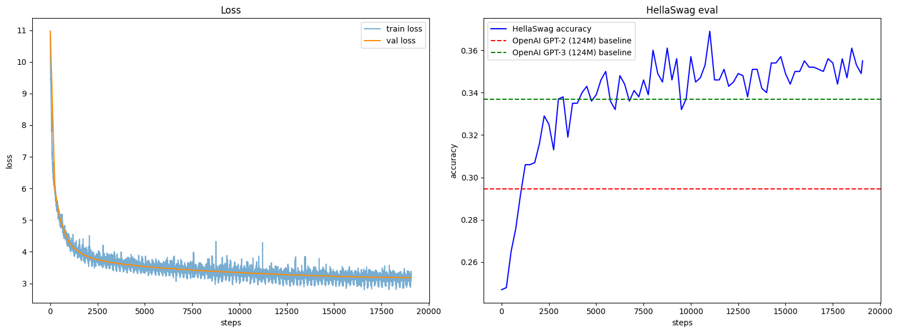

# GPT-2 (124M) — Reproduction + RoPE + SwiGLU (FineWeb-Edu 10BT)

This repository contains my full reproduction of **GPT-2 (124M)**, trained **from scratch** on **FineWeb-Edu 10BT**, with additional modern improvements:

- **RoPE positional embeddings (LLaMA style)**
- **SwiGLU feed-forward layers**
- **AdamW optimizer + cosine LR schedule**
- **HellaSwag evaluation (1000 samples)**

Training was performed on:

- **GPU:** RTX 5090 (32GB) × 1  
- **Training time:** ~28 hours  
- **Framework:** PyTorch  
- **Base implementation:** Karpathy’s *build-nanoGPT* 

---

## 📌 Background

I started from **Andrej Karpathy’s Zero-to-Hero series**, including:

- *Building micrograd*
- *Build makemore series*
- *Let's build GPT*
- *Let's reproduce GPT-2 (124M)*

This project is the **final result of my journey**, where I learned LLM fundamentals entirely from scratch and extended the model with modern components such as RoPE and SwiGLU.

Base repositories referenced:

- https://github.com/karpathy/build-nanogpt  
- https://github.com/garg-aayush/building-from-scratch/tree/main/gpt-2  

---

## 🧠 Model Architecture

| Component | Setting |
|----------|--------|
| Model size | 124M parameters |
| Context length | 1024 |
| Attention | Multi-head causal self-attention |
| Positional encoding | **RoPE (rotary)** |
| MLP activation | **SwiGLU** |
| Dataset | **FineWeb-Edu (10BT tokens)** |
| Optimizer | AdamW |
| LR schedule | Cosine decay |

---

## 📈 Training Results

### 🔹 Final Results
validation loss: 3.1811
HellaSwag accuracy: 0.355 (355/1000)

### 🔹 Best Results
best loss: 2.8970
best HellaSwag accuracy: 0.369

### 📌 Baselines for comparison
| Model | HellaSwag |
|-------|-----------|
| OpenAI GPT-2 (124M) | ~0.292 |
| OpenAI GPT-3 (124M equivalent) | ~0.338 |
| **This model (best)** | **0.369** |
| **This model (final)** | **0.355** |

➡ **Achieved accuracy higher than GPT-3-124M baseline**, due to RoPE + SwiGLU + better dataset.

---

## 📊 Plots

### Loss & HellaSwag curves
Plots are included in the `plots/` directory.

  

---

## 🧪 HellaSwag Evaluation Notes

- Evaluation uses **1000 samples** by default.  
- Using **10000 samples** severely reduces throughput (`tok/sec`) and significantly increases evaluation time on a single GPU.  

## 🚀 Training

This script loads FineWeb-Edu shards and trains a GPT-2 124M replica with RoPE + SwiGLU.

---

## 📚 References

- FineWeb-Edu dataset  
- HellaSwag dataset  
- Andrej Karpathy — Zero to Hero series  
- build-nanoGPT  

---

## ✨ Summary

This repository is the culmination of my “Zero-to-Hero” learning journey, beginning with Karpathy’s bi-gram model and ending with a full GPT-2 reproduction enhanced with modern techniques.

It demonstrates:

- that **124M models can still be competitive** with modern tweaks  
- that **consumer GPUs (RTX 5090 x1)** can train a GPT-2 scale model from scratch  
- and that **LLM fundamentals can be learned deeply through hands-on replication**

Feel free to explore, fork, or reproduce the results!

